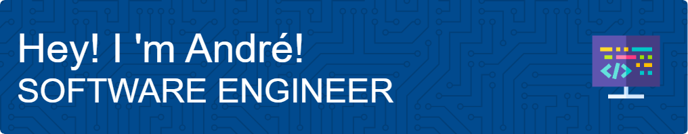

## About Me
- 🔭 I’m currently working on project Inception.
- 🌱 I’m learning Docker.
- 💬 Ask me about my projects!

## 📫 How to reach me: 

  
  

## Skills

  
  
  
  
  
  
  
  
  
  
  
  
  

## Projects
## Table of Contents

- [42 School Portfolio Generator](#42-school-portfolio-generator) - Skills: Python, Flask, CLI, UX design
- [Minishell](#minishell) - Skills: C programming, processes, file descriptors, command execution, etc.
- [libft](#libft) - Skills: C programming, Algorithm implementation, string manipulation, Memory manipulation, Makefile usage, Norm compliance, Error handling
- [ft_printf](#ft_printf) - Skills: C programming, Variadic functions, Memory management, Makefile usage, Norm compliance, Error handling
- [get_next_line](#get_next_line) - Skills: C programming, File I/O, Memory management, Static variables, Buffer handling, Function implementation, Norm compliance
- [born2beroot](#born2beroot) - Skills: System administration, Virtualization, Operating system installation and configuration, Security measures, Bash scripting, Monitoring
- [push_swap](#push_swap) - Skills: C programming, Algorithmic thinking, Sorting algorithms, Stack manipulation, Complexity analysis, Error handling, Makefile usage, Efficient code optimization
- [minitalk](#minitalk) - Skills: C programming, Interprocess communication, UNIX signals, Error handling, Memory management, Makefile usage, Client-server architecture
- [so_long](#so_long) - Skills: C programming, Window management, Event handling, Game development, Graphics programming, MiniLibX library, Error handling, Memory management, Makefile usage
- [philosophers](#philosophers) - Skills: C programming, Threading, Mutexes, Concurrent programming, Synchronization, Resource management, Time management, Error handling, Makefile usage
- [NetPractice](#netpractice) - Skills: Networking Concepts, Configuration Management, System Administration, Problem-Solving, Web Interface Usage, Git Repository Management
- [cub3d](#cub3d) - Skills: C programming, Algorithm implementation, Graphic design, Ray-casting, MiniLibX library usage, Mathematics in game development
- [Inception](#inception) - Skills: System Administration, Docker, Virtualization, Docker Compose, Dockerfiles, NGINX, WordPress, MariaDB, TLS, Security Best Practices
- [CPP Piscine](#cpp-piscine) - Skills: C++ programming, Object-oriented programming
- [ft_irc](#ft_irc) - Skills: C++, Network Programming, IRC Protocol, TCP/IP, Non-blocking I/O, Polling, Error Handling
- [ft_transcendence](#ft_transcendence) - Skills: Web development (JavaScript, HTML, CSS), Full-stack development

  
💻 Description 

  
### [42 School Portfolio Generator](https://github.com/abaiao-r/42-Portfolio-Generator)

- **Objective:** Provide 42 students with an efficient tool for generating and visualizing project portfolios.
- **Skills:** Python, Flask, CLI, UX design.
- **Relevance:** Demonstrated proficiency in API integration, automation, and web development.

### [Minishell](https://github.com/abaiao-r/minishell)

- **Objective:** Develop a robust custom shell in C, focusing on process management, file descriptors, and command execution.
- **Skills:** C programming, processes, file descriptors, command execution, etc.
- **Relevance:** Showcases expertise in low-level programming, system calls, and file descriptors.

### [libft](https://github.com/abaiao-r/libft)

- **Objective:** Implement a C library containing general-purpose functions relied upon by programs.
- **Skills:** C programming, Algorithm implementation, string manipulation, Memory manipulation, Makefile usage, Norm compliance, Error handling.
- **Relevance:** Understanding and implementing standard C library functions, enhancing C programming skills.

### [ft_printf](https://github.com/abaiao-r/ft_printf)

- **Objective:** Recode the printf() function in C, creating a library named libftprintf.a.
- **Skills:** C programming, Variadic functions, Memory management, Makefile usage, Norm compliance, Error handling.
- **Relevance:** Enhancing C programming skills, understanding variadic functions, and creating a custom printf() function.

### [get_next_line](https://github.com/abaiao-r/get_next_line)

- **Objective:** Create a function, get_next_line, which reads a line from a file descriptor.
- **Skills:** C programming, File I/O, Memory management, Static variables, Buffer handling, Function implementation, Norm compliance.
- **Relevance:** Learn a new concept in C programming (static variables), improve file reading skills, and implement a function to read lines conveniently.

### [born2beroot](https://github.com/abaiao-r/born2beroot)

- **Objective:** Set up a virtual machine with specific rules, including the installation and configuration of an operating system, security measures, and the creation of a monitoring script.
- **Skills:** System administration, Virtualization, Operating system installation and configuration, Security measures, Bash scripting, Monitoring.
- **Relevance:** Gain practical experience in setting up and securing a virtual machine, understanding system administration concepts.

### [push_swap](https://github.com/abaiao-r/push_swap)

- **Objective:** Implement a sorting algorithm in C using two stacks and a set of operations.
- **Skills:** C programming, Algorithmic thinking, Sorting algorithms, Stack manipulation, Complexity analysis, Error handling, Makefile usage, Efficient code optimization.
- **Relevance:** Develop algorithmic and sorting skills, understand complexity in sorting algorithms, and practice C programming.

### [minitalk](https://github.com/abaiao-r/minitalk)

- **Objective:** Create a small data exchange program using UNIX signals.
- **Skills:** C programming, Interprocess communication, UNIX signals, Error handling, Memory management, Makefile usage, Client-server architecture.
- **Relevance:** Familiarize with interprocess communication using signals, error handling, and efficient string transmission.

### [so_long](https://github.com/abaiao-r/so_long)

- **Objective:** Develop a small 2D game improving skills in window management, event handling, color usage, and texture management.
- **Skills:** C programming, Window management, Event handling, Game development, Graphics programming, MiniLibX library, Error handling, Memory management, Makefile usage.
- **Relevance:** Focuses on developing fundamental skills required for creating graphical applications.

### [philosophers](https://github.com/abaiao-r/philosophers)

- **Objective:** Simulate the dining philosophers problem using threads and mutexes.
- **Skills:** C programming, Threading, Mutexes, Concurrent programming, Synchronization, Resource management, Time management, Error handling, Makefile usage.
- **Relevance:** Provides hands-on experience in working with threads and mutexes, essential concepts in concurrent programming.

### [NetPractice](https://github.com/abaiao-r/NetPractice)

- **Objective:** Undertake a practical exploration of networking concepts through a System Administration exercise.
- **Skills:** Networking Concepts, Configuration Management, System Administration, Problem-Solving, Web Interface Usage, Git Repository Management.
- **Relevance:** Gain hands-on experience in networking concepts, addressing, and problem-solving related to network configurations.

### [cub3d](https://github.com/abaiao-r/cub3d)

- **Objective:** Create a 3D graphical representation of a maze inspired by the classic Wolfenstein 3D game.
- **Skills:** C programming, Algorithm implementation, Graphic design, Ray-casting, MiniLibX library usage, Mathematics in game development.
- **Relevance:** Enhance skills in C programming, algorithm implementation, and graphic design.

### [Inception](https://github.com/abaiao-r/Inception) 

- **Objective:** Expand knowledge of system administration through Docker. Virtualize Docker images in a personal virtual machine, creating a small infrastructure with specific services and rules.
- **Skills:** System Administration, Docker, Virtualization, Docker Compose, Dockerfiles, NGINX, WordPress, MariaDB, TLS, Security Best Practices.
- **Relevance:** Gain practical experience in Docker usage, virtualization, and infrastructure setup.

### [CPP Piscine](https://github.com/abaiao-r/CPP_Piscine)

- **Objective:** Explore and practice C++ programming with various exercises.
- **Skills:** C++ programming, Object-oriented programming.
- **Relevance:** Delve into C++ programming and object-oriented concepts.

### [ft_irc](https://github.com/abaiao-r/ft_irc)

- **Objective:** Develop an IRC server in C++, adhering to IRC standards. Create a robust server capable of handling multiple clients simultaneously and supporting essential IRC functionalities.
- **Skills:** C++, Network Programming, IRC Protocol, TCP/IP, Non-blocking I/O, Polling, Error Handling.
- **Relevance:** Gain practical experience in network programming, socket programming, and implementing IRC server functionalities.

### [ft_transcendence](https://github.com/abaiao-r/ft_transcendence)

- **Objective:** Build a web-based platform for competitive multiplayer games.
- **Skills:** Web development (JavaScript, HTML, CSS), Full-stack development.
- **Relevance:** Focus on web development and full-stack development.

<!-- Add more projects following the same structure -->

Feel free to explore my projects and reach out for collaborations or discussions. Let's code the future together! 🚀
